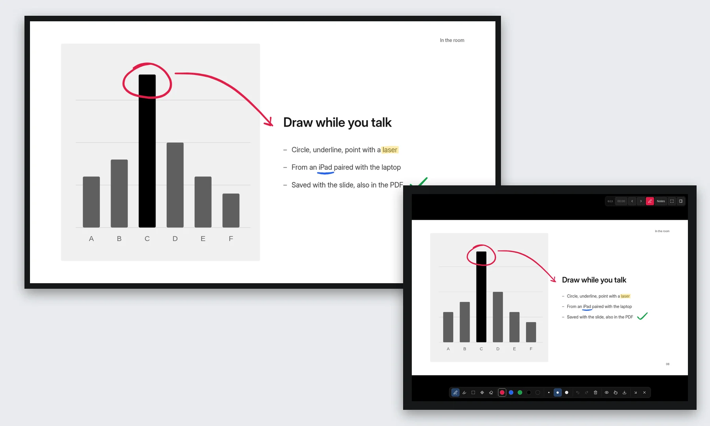
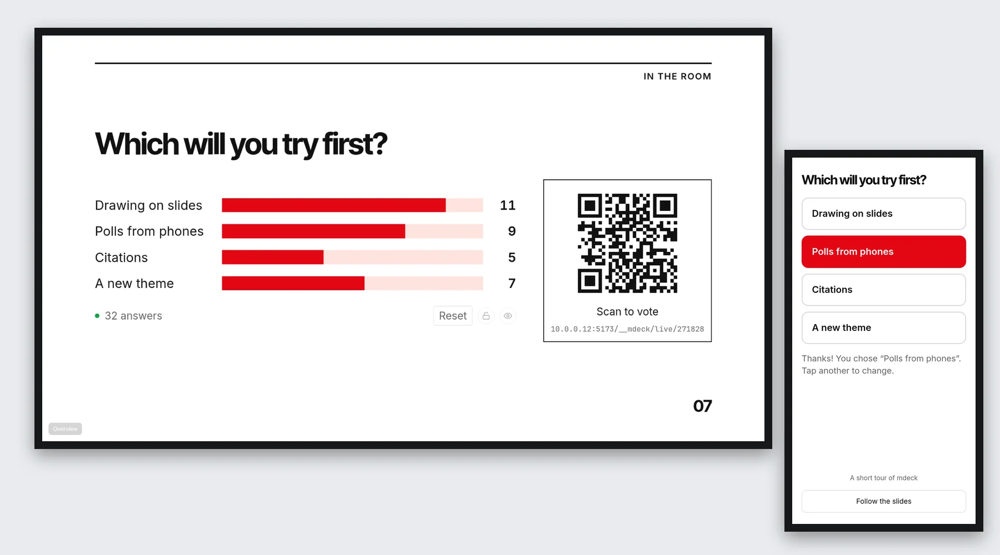
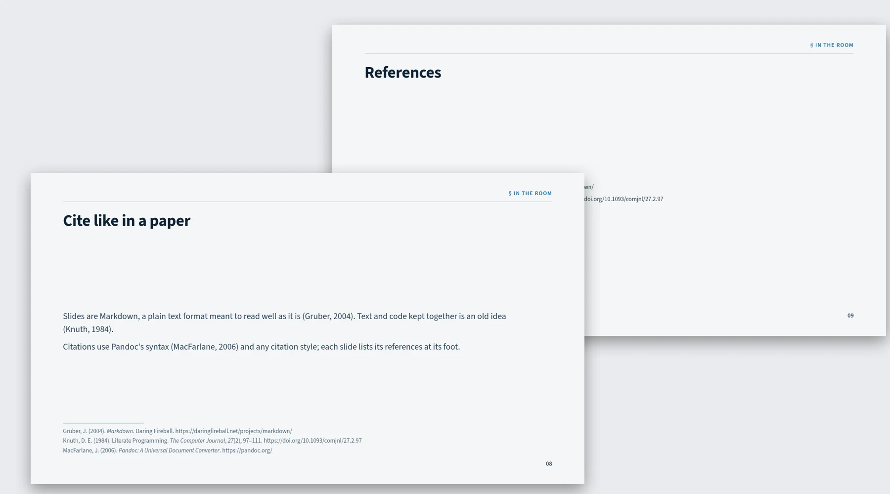
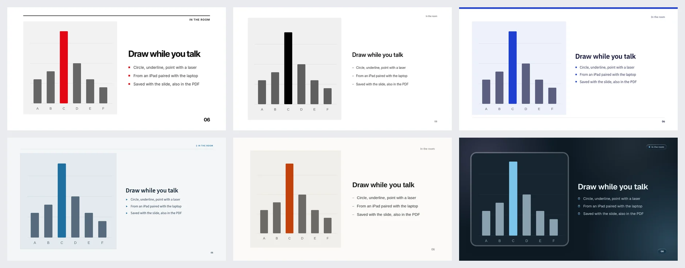
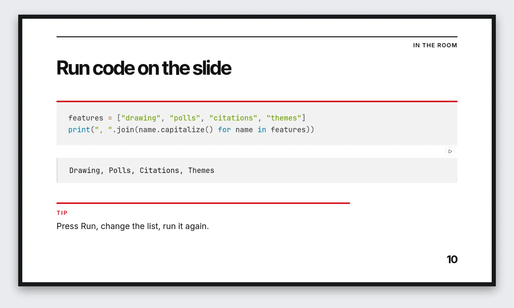
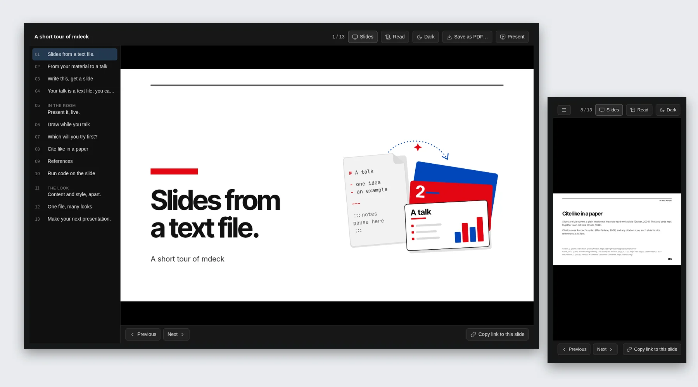

<p align="center">
  <picture>
    <source media="(prefers-color-scheme: dark)" srcset="assets/logo/logo-dark.svg">
    
  </picture>
</p>

<p align="center"><b>Hand your slides, papers and notes to an AI assistant. Get a clean deck to present in the browser. Share it as one HTML file or a PDF.</b></p>

<p align="center">
  <a href="https://gh.tschieber.de/mdeck/">Docs</a> ·
  <a href="https://www.npmjs.com/package/mdeck">Package</a> ·
  <a href="CHANGELOG.md">Changelog</a> ·
  <a href="LICENSE">MIT license</a>
</p>

## What you can do with it

<table>
<tr>
<td width="50%" valign="top">
<a href="docs/site/images/features/drawing.webp"></a>
<p><b><a href="https://gh.tschieber.de/mdeck/drawing.html">Draw on your slides, from an iPad if you like</a></b><br>
Circle a number, underline a phrase, point with a laser. Pair an iPad by scanning a code, and it becomes your presenter screen and drawing pad while the laptop drives the projector: every stroke shows on the big screen as you draw.</p>
</td>
<td width="50%" valign="top">
<a href="docs/site/images/features/polls.webp"></a>
<p><b><a href="https://gh.tschieber.de/mdeck/audience.html">Ask the room, and show the answers on the slide</a></b><br>
Polls, scales, word clouds, open questions and numbers to guess. People scan the code and answer on their phones, no app needed, and the bars grow as votes come in. Close the vote, discuss, reveal the right answer.</p>
</td>
</tr>
<tr>
<td width="50%" valign="top">
<a href="docs/site/images/features/citations.webp"></a>
<p><b><a href="https://gh.tschieber.de/mdeck/more-content.html#cite-a-source">Cite your sources properly</a></b><br>
Cite as in a paper, <code>[@knuth1984, p. 97]</code>, from the BibTeX, CSL-JSON or Hayagriva file you already keep. Each slide lists what it cites at its foot, in APA, Vancouver, Harvard or any CSL style.</p>
</td>
<td width="50%" valign="top">
<a href="docs/site/images/features/themes.webp"></a>
<p><b><a href="https://gh.tschieber.de/mdeck/appearance.html">Write the content once, change the look anytime</a></b><br>
The file holds what you say; a theme and a palette decide how it looks. One line changes every slide, light or dark. Six themes come with mdeck, more are in the <a href="https://gh.tschieber.de/mdeck-themes/">theme repository</a>.</p>
</td>
</tr>
<tr>
<td width="50%" valign="top">
<a href="docs/site/images/features/code.webp"></a>
<p><b><a href="https://gh.tschieber.de/mdeck/more-content.html#show-a-code-example">Run code on the slide</a></b><br>
Give a Python or JavaScript example a Run button, change it in front of the audience and run it again. Python runs in the browser, NumPy and pandas included.</p>
</td>
<td width="50%" valign="top">
<a href="docs/site/images/features/reader.webp"></a>
<p><b><a href="https://gh.tschieber.de/mdeck/sharing.html">Send one file that anyone can open</a></b><br>
<code>mdeck send</code> makes a single HTML file: an outline, a reading mode for phones, light and dark, and the PDF inside. It opens in any browser, offline too, without your speaker notes.</p>
</td>
</tr>
</table>

## Start from what you have

```text
/write-slides Rebuild lecture-03.pptx and my notes in notes.md as a
20-minute talk for second-year students. Keep the figures, split the
crowded slides, and start with a poll.
```

Old PowerPoint decks, PDFs, Word documents, papers and rough notes all work.
mdeck ships a `write-slides` skill for Claude Code, Codex, Cursor, Copilot,
Gemini and any other assistant. It reads your material, keeps your content and
pictures, rebuilds it in the layouts and looks your folder provides, writes
speaker notes from your text, and checks the result with mdeck. Then you keep
asking: “split slide 4”, “use a dark look”, “you left out the table on page 3”.

## A presentation is a text file

mdeck slides are Markdown, which is close to the native language of AI
assistants: they write it all day, so they write good slides without operating
any slide software. And it stays plain text you can read, review and change
yourself:

```markdown
---
theme: neue
meta:
  title: Enzyme kinetics
  author: Alex Morgan
---

---
:::meta
layout: title
:::
# Enzyme kinetics
## How fast, and why

---
# Rate depends on substrate

- Michaelis–Menten describes saturation
- $K_m$ is the half-saturation point

:::notes
Ask who has seen the curve before.
:::
```

Saved as `talk.md`, `mdeck run talk.md` turns it into a slide deck with a title slide, a content
slide, a theme, and your notes in the presenter view. The preview reloads
whenever you or the assistant change the file.

<p align="center"></p>

## One file, any look

The same slide file rendered with built-in themes and themes from the
[theme repository](https://github.com/tilman-schieber/mdeck-themes). Change
one line in the settings, or pick from the presenter view, and the whole deck
repaints.

<p align="center"></p>

Try it yourself: the [docs home page](https://gh.tschieber.de/mdeck/)
embeds a live deck with a theme switcher.

## Install

You need [Node.js](https://nodejs.org) 22 or newer:

```sh
npm install -g mdeck
mdeck --help
```

Installed mdeck from the FHNW GitLab registry before? Switch with
`npm uninstall -g @tilman.schieber/mdeck`, then install as above.

Working from a clone instead? See [CONTRIBUTING.md](CONTRIBUTING.md).

Then teach your assistant about mdeck:

```sh
mdeck skill --install claude   # or codex, cursor, copilot, gemini; --print for anything else
```

See [Work with an AI assistant](docs/reference/claude-skill.md) for briefing
tips, follow-up requests and what to check before presenting.

## First steps

```sh
mdeck new                    # no assistant? answer a few questions, get a starter file
mdeck run talk.md            # launch page: present, edit, send and check; reloads on save
mdeck run talk.md --network  # also reachable from phones, e.g. for a poll
mdeck run talk.md --server   # present from an iPad on any network, through your server
mdeck build talk.md --reader # dist/ reader folder to host, notes removed
mdeck send talk.md           # one file to email, with a PDF inside
```

## What you get

- **Layouts:** title, chapter, big statement, image and text, split, full-bleed image, and plain content slides, with points that appear one at a time.
- **Looks:** six built-in themes and six colour palettes, each light or dark, changeable without touching the slides. Install more from the [theme repository](https://gh.tschieber.de/mdeck-themes/) with `mdeck themes install`, or make your own as small `extension.toml` folders beside the deck.
- **One launch page:** `mdeck run` opens a page with a live preview, the presenter and audience views, the deck and reader views, the editor, the guides, one-click builds and PDF, the deck's check results, and for decks with a server its health and the presenter code.
- **Presenting:** a presenter view with notes and timer, and an audience window that stays in sync.
- **Drawing on slides:** pen with pressure, highlighter and a laser pointer, with a mouse, a finger or an iPad pencil (`D`). Drawings are saved in `<deck>.drawings.json` beside the deck and appear in every view, build and PDF. An iPad can present on its own, or pair with the laptop through a QR code on the launch page while the laptop's audience window follows it.
- **Audience questions:** `<poll room="lunch" options="A|B|C" />` shows live results and a QR code; people vote on their phones. `<scale>`, `<wordcloud>` and `<question>` ask for a rating, words or open answers, and `<qrcode join />` shows the join code once for all of them. Rooms run inside `mdeck run --network` or on a small server (`mdeck server`).
- **Sharing:** a reader view with an outline, a phone-friendly Read mode and a PDF download; speaker notes are stripped from shared builds, and interactive slides appear in their finished state.
- **Citations:** cite with `[@key]` from BibTeX, CSL-JSON or Hayagriva files; each slide lists its references at its foot, `<bibliography />` lists them all, in any CSL style.
- **Content:** pictures, video, tables, callouts, code with syntax highlighting and live execution, formulas, QR codes, and your own Preact components, kept with one deck or shared between decks.
- **New designs on request:** ask your assistant for a palette, theme, layout or interactive component; it keeps them as small folders beside the deck.
- **Editing in the browser:** `mdeck edit talk.md` opens an editor with a live preview and forms for slides and settings, and `mdeck design` shows themes and palettes on a sample deck for fine-tuning. It writes back into your text file.

## Read the docs

The docs are written for people who have never used Markdown or a terminal.
They start with working alongside an AI assistant and explain the file format
so you can read and adjust what it writes:

- Online: <https://gh.tschieber.de/mdeck/>
- Offline, from any folder once mdeck is installed: `mdeck docs`

Technical references for layout, theme and tool authors live in
[docs/reference](docs/reference/).

## Examples

Each example keeps its assets beside its slide source so it can be copied as a
complete folder.

| Example | Theme | What it demonstrates |
|---|---|---|
| [Tour](examples/showcase/slides.md) | Glass | Start here: each slide shows the Markdown beside what it becomes, from headings to layouts, live code, notes, drawing, a poll and sharing |
| [Python](examples/python/slides.md) | Academic | A real lesson: live code to try out, points revealed step by step, notes on every slide, a poll to check understanding |
| [Poll](examples/poll/slides.md) | Neue | A join slide, then a poll, a scale, a word cloud and open questions; start it with `mdeck run slides.md --network` |
| [Custom layouts](examples/custom-layouts/slides.md) | Neue | A deck-local comparison design and named regions |

The docs home page embeds a short talk, and the screenshots above show Neue.

## Made at FHNW

mdeck is developed at the School of Life Sciences FHNW for lectures, labs and
talks. Issues and ideas: <https://github.com/tilman-schieber/mdeck/issues>.
